# Workplace Safety Image Analyser

A FastAPI service that validates a workplace image, detects people, forklifts and PPE, evaluates safety rules, and returns a structured risk assessment.

The original task specification is preserved in [ASSIGNMENT.md](ASSIGNMENT.md).

## What I implemented

- Detection for `person`, `forklift`, `safety_hat` and `safety_vest`.
- A safety rule engine supporting missing-PPE and person–forklift proximity detection.
- Risk assessment with configurable event scores and an overall risk rating.
- Versioned configuration for detector models, prompts, thresholds, safety rules and risk scoring.
- Reproducible model comparison and visual analysis reports.

### Analysis results

| | |
|---|---|
| 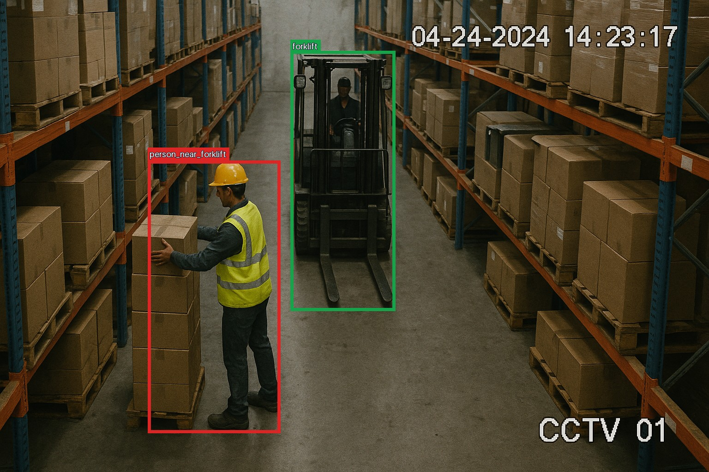 | 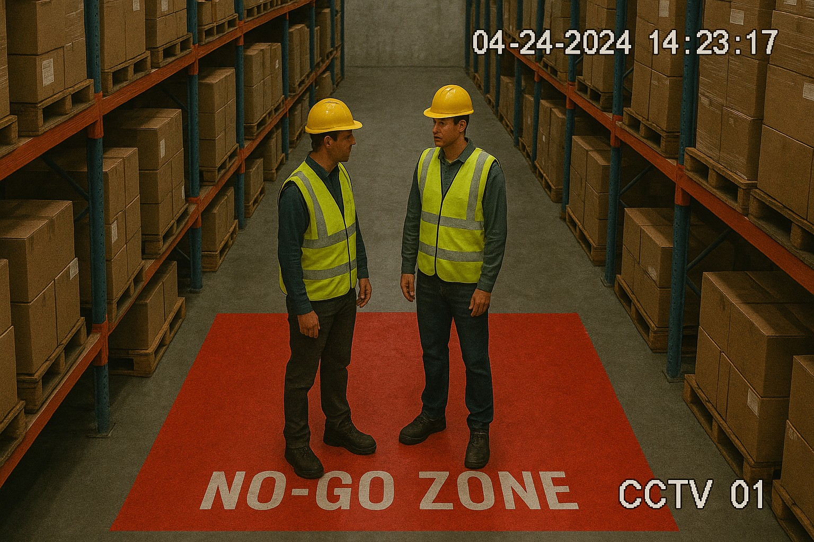 |
| 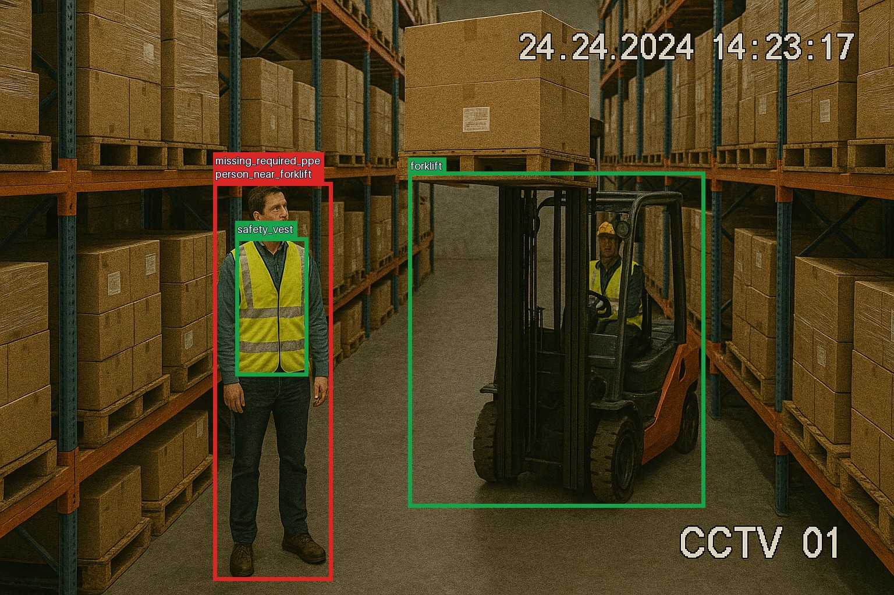 | 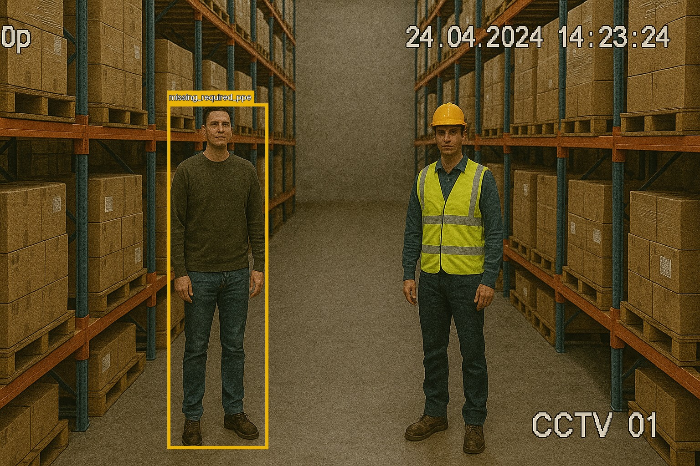 |
| 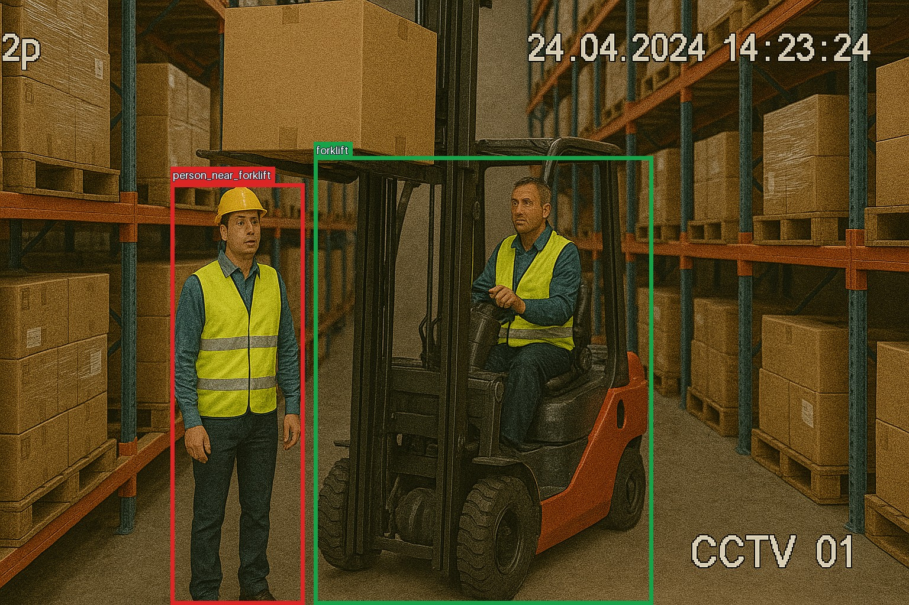 | 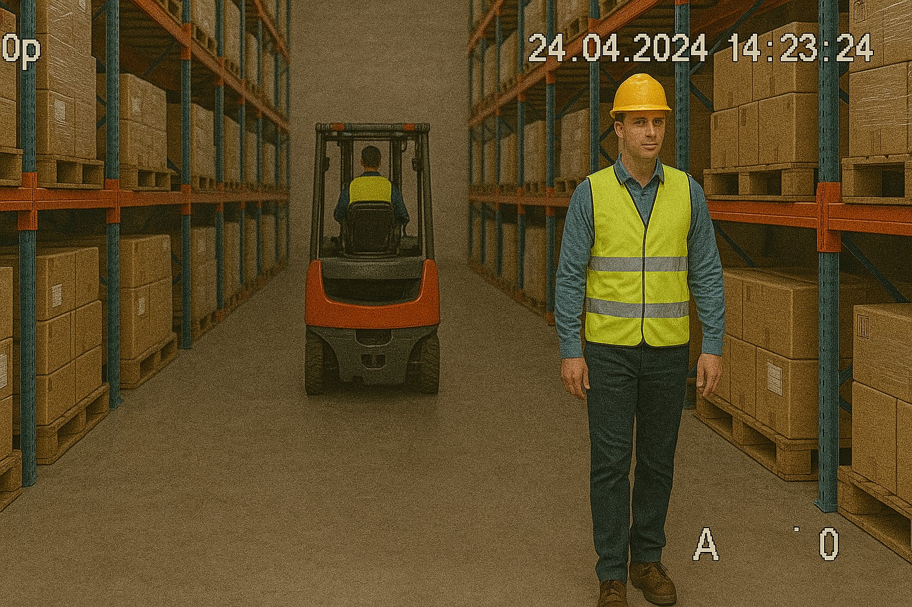 |

See the complete [analysis report](tools/analysis_report/reports/20260829-085206/report.html) for risk summaries, event evidence and full `/analyse` responses.

## Dev Environment Setup

Requirements: Python 3.13+, [uv](https://docs.astral.sh/uv/) and Git.

```bash
uv sync
uv run uvicorn inviol_image_analyser_assignment:app --reload
```

Open [http://localhost:8000/docs](http://localhost:8000/docs), or analyse a sample image:

```bash
curl --fail \
  -X POST \
  -F "file=@sample_images/image_05.png;type=image/png" \
  http://localhost:8000/analyse
```

## API

| Method | Path | Purpose |
|---|---|---|
| `GET` | `/healthcheck` | Service health check |
| `POST` | `/object-detection` | Return normalized detections |
| `POST` | `/safety-detection` | Return objective safety-rule events |
| `POST` | `/analyse` | Return the complete risk assessment |

Example `/analyse` response:

```json
{
  "image": {"width": 1536, "height": 1024},
  "overall_risk": {"score": 9.0, "level": "high"},
  "detected_objects": [
    {
      "object_type": "person",
      "confidence": 0.937,
      "bounding_box": {"x_min": 0.1878, "y_min": 0.3032, "x_max": 0.3348, "y_max": 1.0}
    },
    {
      "object_type": "forklift",
      "confidence": 0.265,
      "bounding_box": {"x_min": 0.3453, "y_min": 0.2583, "x_max": 0.718, "y_max": 1.0}
    }
  ],
  "events": [
    {
      "rule_type": "person_near_forklift",
      "risk": {"score": 9.0, "level": "high"},
      "subject": {
        "object_type": "person",
        "confidence": 0.937,
        "bounding_box": {"x_min": 0.1878, "y_min": 0.3032, "x_max": 0.3348, "y_max": 1.0}
      },
      "related_objects": [
        {
          "object_type": "forklift",
          "confidence": 0.265,
          "bounding_box": {"x_min": 0.3453, "y_min": 0.2583, "x_max": 0.718, "y_max": 1.0}
        }
      ],
      "attributes": {"normalized_distance": 0.0087, "maximum_normalized_distance": 0.08}
    }
  ]
}
```

| Setting | Description |
|---|---|
| `image.width`, `image.height` | Original image dimensions in pixels. |
| `overall_risk.score` | Highest risk score across all events; `0` when no event is detected. |
| `overall_risk.level` | Risk level derived from the configured score thresholds. |
| `detected_objects` | All detections accepted by the configured confidence thresholds. |
| `object_type` | Domain label such as `person`, `forklift`, `safety_hat` or `safety_vest`. |
| `confidence` | Confidence returned by the object detection model. |
| `bounding_box` | Normalized `x_min`, `y_min`, `x_max` and `y_max` coordinates. |
| `events` | Safety events produced by the configured rules. |
| `events[].rule_type` | Stable identifier of the triggered safety rule. |
| `events[].risk` | Configured score and derived level for this event. |
| `events[].subject` | Primary detection affected by the event. |
| `events[].related_objects` | Other detections involved in or associated with the event. |
| `events[].attributes` | Rule-specific evidence, such as missing PPE or normalized distance. |

## Architecture

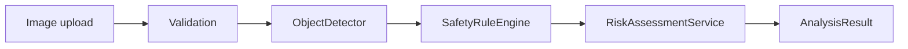

Each layer has one responsibility:

1. **Object detection** returns object type, confidence and normalized bounding boxes.
2. **Safety detection** converts spatial relationships into objective events.
3. **Risk assessment** applies configurable severity policy.
4. **FastAPI** validates input and composes the stages.

### Project structure

```text
src/inviol_image_analyser_assignment/
├── app.py                         # FastAPI endpoints and pipeline composition
├── config.py                      # Typed configuration models and loaders
├── models/                        # Detection, safety-event and response models
└── services/
    ├── object_detection/
    │   ├── detector.py            # ObjectDetector protocol and adapter factory
    │   ├── yolo_world.py          # Active YOLO-World adapter
    │   ├── grounding_dino.py      # Example alternative detector adapter
    │   └── geometry.py            # Shared bounding-box operations
    ├── safety_detection/          # Safety rule engine and rule implementations
    └── risk_assessment/           # Event scoring and AnalysisResult assembly

config/
├── analysis.json                  # Selects active versioned configurations
├── object_detection/              # Detector, model and threshold configuration
└── safety_rules/                  # Rule thresholds and risk policy

tests/                              # Unit and API tests
tools/                              # Model comparison and analysis reports
weights/yolo_world/                 # Versioned YOLO-World model artifacts
```

### Replacing the YOLO-World model

A compatible fine-tuned YOLO-World checkpoint can be introduced without changing application code:

1. Add the `.pt` file under `weights/yolo_world/`.
2. Create a new versioned file under `config/object_detection/`.
3. Set `model_source` to the new checkpoint and calibrate its target thresholds.
4. Point `config/analysis.json` to the new configuration and restart the service.
5. Run the tests and sample analysis report before selecting it for use.

### Switching the object detection architecture

Replacing YOLO-World with a model from another object detection architecture requires an adapter that implements `ObjectDetector` and converts model-specific predictions into the shared `ObjectDetectionResult` format. The safety-rule and risk-assessment layers can then remain unchanged.

For a new architecture:

1. Add an adapter under `services/object_detection/`.
2. Convert its labels, confidence values and bounding boxes to the shared detection models.
3. Register the new type in `DetectorType` and `create_object_detector`.
4. Add its runtime dependency, versioned configuration and adapter tests.

[`grounding_dino.py`](src/inviol_image_analyser_assignment/services/object_detection/grounding_dino.py) is an example adapter for a different object detection architecture and is already registered in the detector factory. YOLO-World remains the active and validated model for this submission.

### Adding a safety rule

To add a rule to the existing [`SafetyRuleEngine`](src/inviol_image_analyser_assignment/services/safety_detection/safety_rule_engine.py):

1. Implement the `SafetyRule` protocol under `services/safety_detection/` with a unique `rule_type` and an `evaluate` method that returns `SafetyEvent` objects.
2. Add its typed configuration to `config.py` and the versioned file under `config/safety_rules/`.
3. Register the rule in `create_safety_rule_engine`.
4. Add the event's scoring policy to `RiskAssessmentService` so it can appear in `/analyse` results.
5. Add unit tests for triggered, non-triggered and boundary cases.

A safety rule should return objective evidence through `subject`, `related_objects` and `attributes`; risk scores remain in the separate risk-assessment layer.

## Model selection

The supplied images include PPE categories outside a standard COCO detector, so four pretrained models were compared on the same six images:

| Model | Observed coverage | Median CPU inference (Apple M4) | Outcome |
|---|---|---:|---|
| YOLOv8n | `person` only | ~40 ms | Fixed-vocabulary baseline |
| YOLOv8s-World-v2 | All four target categories | ~69 ms | Selected |
| OWLv2 base | All four target categories | ~5.8 s | Too slow |
| Grounding DINO tiny | All four target categories | ~9.5 s | Slower and less reliable on this sample |

Test environment: MacBook Air, Apple M4 10-core CPU, 32 GB memory.

YOLO-World was selected for its object coverage and CPU latency. The prompt `material handling vehicle` maps to `forklift` in the API.

### Selected YOLO-World output

| | |
|---|---|
| 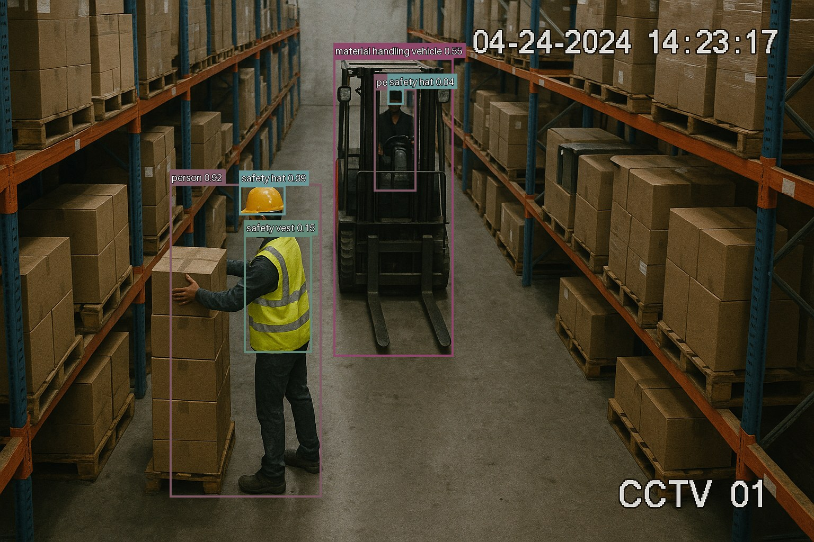 | 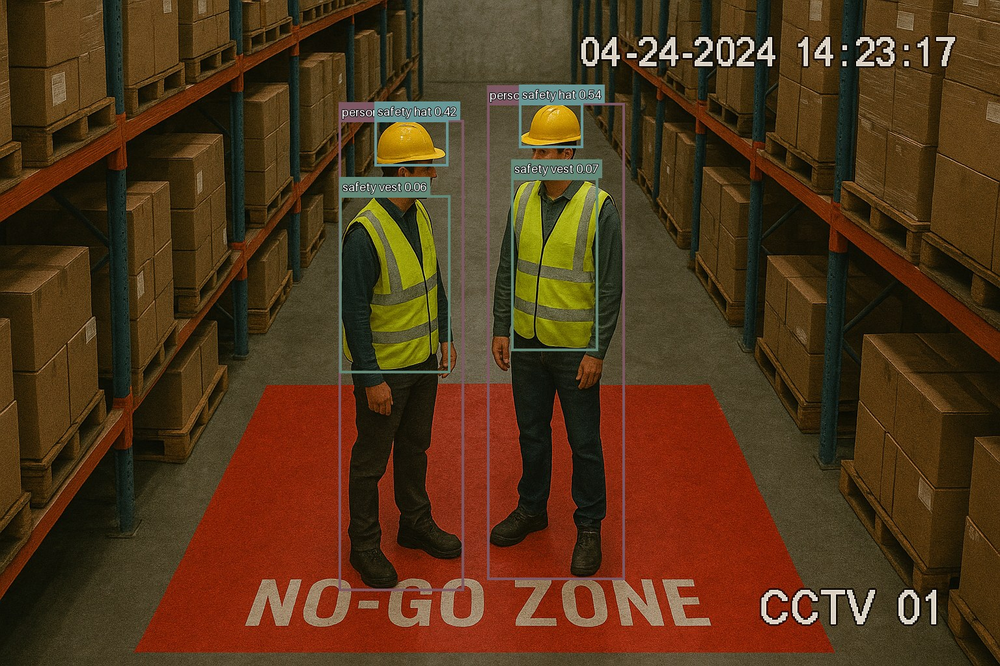 |
| 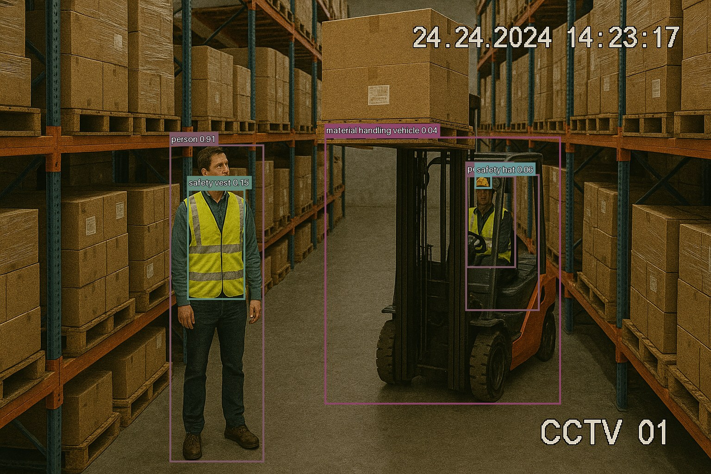 | 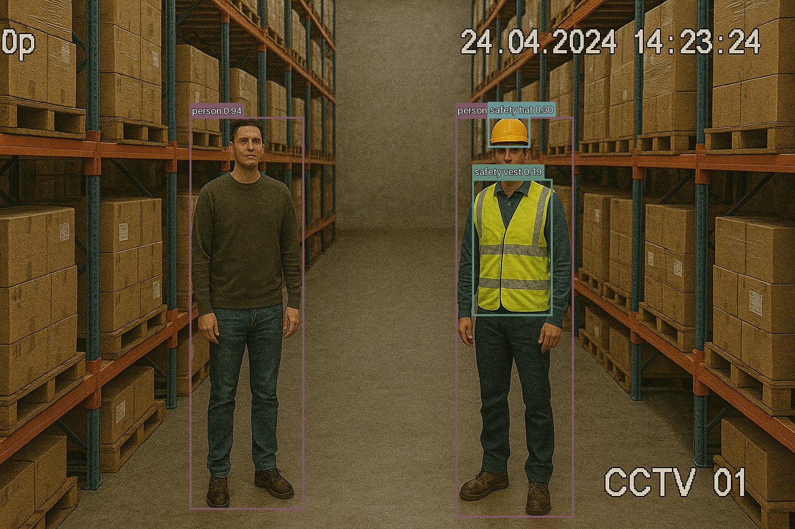 |
| 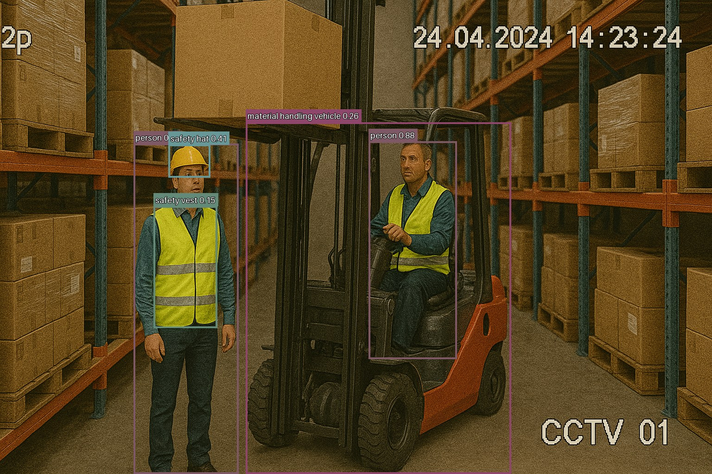 | 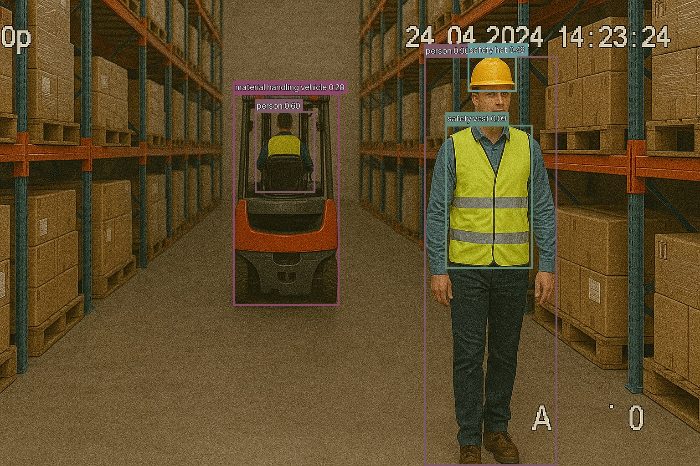 |

See the complete [model comparison report](tools/model_spike/reports/20260829-002617/report.html) and its [methodology](tools/model_spike/README.md).

## Configuration

[config/analysis.json](config/analysis.json) selects versioned detector and safety-policy files:

```json
{
  "object_detection_config": "object_detection/object_detection-v0.1.1.json",
  "safety_rules_config": "safety_rules/safety_rules-v0.1.0.json"
}
```

### Object detection configuration

Active configuration: [`config/object_detection/object_detection-v0.1.1.json`](config/object_detection/object_detection-v0.1.1.json)

```json
{
  "detector_type": "yolo_world",
  "model_source": "weights/yolo_world/workplace-safety-yolo-world-v0.1.pt",
  "image_size": 640,
  "nms_iou_threshold": 0.5,
  "targets": {
    "person": {
      "prompt": "person",
      "confidence_threshold": 0.2
    },
    "forklift": {
      "prompt": "material handling vehicle",
      "confidence_threshold": 0.035
    },
    "safety_hat": {
      "prompt": "safety hat",
      "confidence_threshold": 0.04
    },
    "safety_vest": {
      "prompt": "safety vest",
      "confidence_threshold": 0.04
    }
  }
}
```

#### General settings

| Setting | Description |
|---|---|
| `detector_type` | Detector adapter to use. `yolo_world` is currently active and validated. |
| `model_source` | Model artifact path. It can point to a newer or fine-tuned compatible checkpoint. |
| `image_size` | Image size passed to the detector for inference. |
| `nms_iou_threshold` | IoU threshold used to suppress overlapping duplicate detections. |

#### Target settings (`targets.<object>`)

| Setting | Description |
|---|---|
| `prompt` | Model prompt mapped to the domain object type. |
| `confidence_threshold` | Minimum confidence accepted for the object type. |

### Safety rule configuration

Active configuration: [`config/safety_rules/safety_rules-v0.1.0.json`](config/safety_rules/safety_rules-v0.1.0.json)

```json
{
  "risk_level_thresholds": {
    "medium_min_score": 4,
    "high_min_score": 7
  },
  "missing_ppe": {
    "required_ppe": [
      "safety_hat",
      "safety_vest"
    ],
    "minimum_ppe_overlap_with_person": 0.5,
    "exclude_forklift_operators": true,
    "minimum_person_overlap_with_forklift": 0.8,
    "risk_assessment": {
      "missing_safety_hat_score": 3,
      "missing_safety_vest_score": 2,
      "multiple_missing_ppe_score": 6
    }
  },
  "person_forklift_proximity": {
    "minimum_person_overlap_with_forklift": 0.8,
    "maximum_normalized_distance": 0.08,
    "risk_assessment": {
      "score": 9
    }
  }
}
```

#### Risk levels (`risk_level_thresholds`)

| Setting | Description |
|---|---|
| `medium_min_score` | Minimum score classified as medium risk. |
| `high_min_score` | Minimum score classified as high risk. |

#### Missing PPE rule (`missing_ppe`)

| Setting | Description |
|---|---|
| `required_ppe` | PPE types required for each non-operator person. |
| `minimum_ppe_overlap_with_person` | Minimum fraction of a PPE box that must overlap a person for association. |
| `exclude_forklift_operators` | Enables exclusion of forklift operators from missing-PPE events. |
| `minimum_person_overlap_with_forklift` | Minimum fraction of a person's box that must overlap a forklift to identify an operator. |

#### Missing PPE risk scores (`missing_ppe.risk_assessment`)

| Setting | Description |
|---|---|
| `missing_safety_hat_score` | Score assigned when only the safety hat is missing. |
| `missing_safety_vest_score` | Score assigned when only the safety vest is missing. |
| `multiple_missing_ppe_score` | Score assigned when more than one required PPE item is missing. |

#### Person–forklift proximity rule (`person_forklift_proximity`)

| Setting | Description |
|---|---|
| `minimum_person_overlap_with_forklift` | Minimum fraction of a person's box that must overlap a forklift to exclude its operator. |
| `maximum_normalized_distance` | Maximum bounding-box gap, normalized by image diagonal, that creates a proximity event. |
| `risk_assessment.score` | Score assigned to an unsafe person–forklift proximity event. |

### Risk assessment

The active scores are example configuration values and can be adjusted without changing rule implementation. Risk levels are `low < 4`, `medium < 7`, and `high >= 7`. Overall risk is the maximum event score; no events produces `0 / low`.

Configuration is validated by Pydantic. After selecting a new version in `analysis.json`, restart the service.

## Tests

Run all quality checks:

```bash
uv run pytest
uv run ruff check .
uv run ruff format --check .
uv run basedpyright
```

The 20 tests cover detector adapters, safety rules, risk assessment, API integration and upload validation. ML inference is mocked.

## Reports

Generate the end-to-end sample report:

```bash
uv run python -m tools.analysis_report.run
```

Re-run the model comparison with optional evaluation dependencies:

```bash
uv run --group model-evaluation python -m tools.model_spike.run
```

## Time allocation

| Time | Work | Details |
|---:|---|---|
| 20 min | Project review | Read the assignment, existing source code and sample images; identified the core evaluation criteria and technical risks. |
| 20 min | Scope definition | Defined the four target object types, two safety rules, high-level architecture, implementation scope and acceptance criteria. |
| 60 min | Model feasibility spike | Compared four pretrained detection models, tuned prompts and confidence thresholds, and generated a visual comparison report. |
| 60 min | Object detection | Implemented configurable YOLO-World inference, label mapping, confidence filtering and normalized detection output. |
| 40 min | Safety rule engine and Rule 1 | Added the common rule interface and output structure, then implemented the missing-PPE rule for safety hats and vests. |
| 20 min | Rule 2: Person near forklift | Implemented the person–forklift proximity rule using normalized bounding-box distance while excluding detected operators. |
| 60 min | Risk assessment and analysis pipeline | Connected detection, safety-rule evaluation and configurable risk scoring into the structured `/analyse` response. |
| 20 min | Validation and edge-case tests | Added JPEG/PNG upload validation, an image size limit and tests for invalid uploads, empty detections and analysis failures. |
| 60 min | Documentation | Documented setup, API usage, architecture, configuration, model selection, tests, reports and limitations. |
| **6 hours** | **Total** | |

## Limitations

| Current limitation | Improvement direction |
|---|---|
| Evaluation is currently based on qualitative review of the six supplied sample images. Without ground-truth annotations, model precision and recall and the safety-rule false-positive rate were not measured. | Build an evaluation dataset with bounding-box and safety-event annotations, then measure both detection and rule performance. |
| Prompts and confidence thresholds were adjusted using only the six sample images, so they may not generalize to other environments. | Expand the labelled dataset across cameras, lighting, viewpoints, PPE styles and work environments, then fine-tune YOLO-World and recalibrate the detection thresholds. |
| `Person near forklift` uses the shortest 2D gap between the person and forklift bounding boxes, normalized by the image diagonal. This is affected by perspective and does not represent physical distance. | Calibrate fixed cameras and project detections onto the ground plane, or use depth estimation to calculate real-world distance. |
| The current configuration and risk scores are example policies that have not been professionally validated. | Review the rules, thresholds and risk levels with workplace-safety specialists and version the approved policy. |
